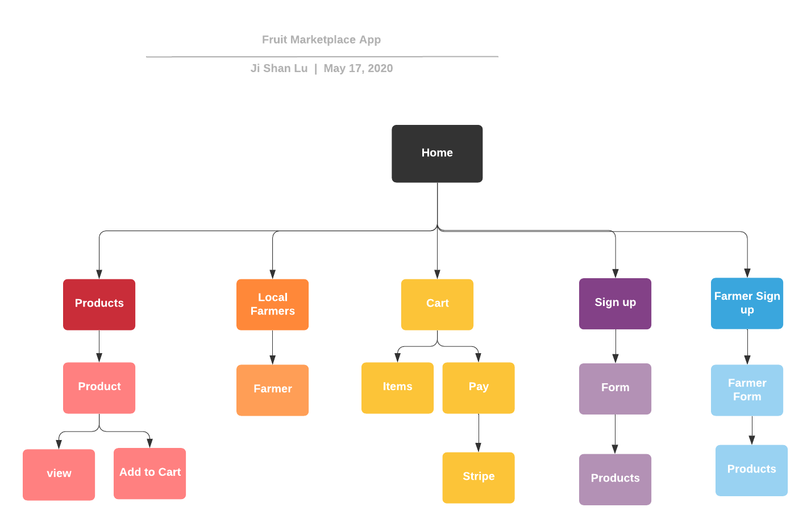
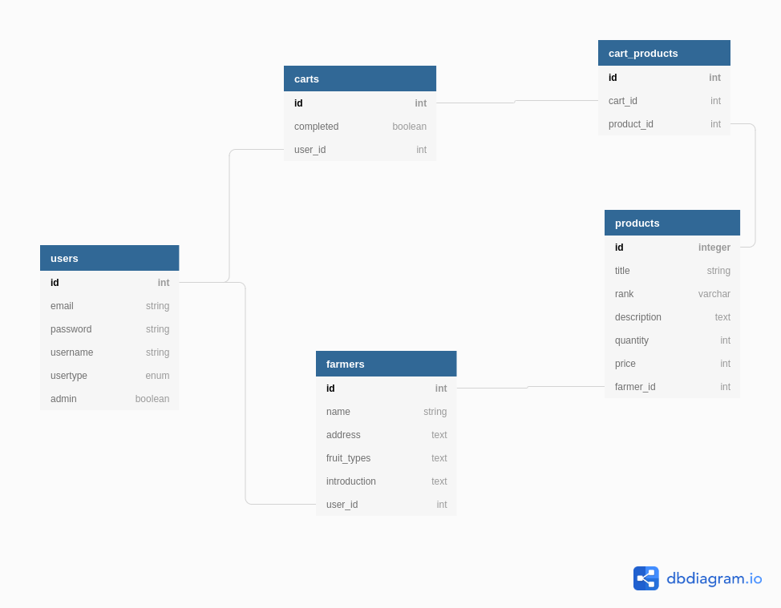

# README

# Two-Sided-Marketplace (fruit marketplace rails app)

### The link to my published App

https://fruit-marketplace-app.herokuapp.com/

### The link to the GitHub repository

https://github.com/jishan33/fruit_marketplace_app

## System Dependencies
 - rails 6.0.3
 - yarn insatll
 - bundle install
 

## Description 

### Purpose
Provide local fruit farmers a friendly online selling platform to assist farmers to increase their profit by saving the middle men handling costs, also to provide the freshest fruits deliver directly from the farms. 

## User Stories

As a buyer, I want to sign up, login, and logout securely as well as make purchases via very secure websites. 

As a farmer, I want to sign up, login, and logout securely. Post my product with high visibility and add new products relatively easy. More importantly, I would like to receive my payment farirly easy and quick too. 

As a admin, I want to have all the features that users and farmers have, except adding new products and receiving payments. Also I want to easily manage users' products and users account.

#### Farmers 
There is a form for farmers to sign up. Once they finised sign up, they can post their products to sell and also update and delete, they can easily manage their products on their dashboard. Also, the completed farmer sign up form will be posted on the local farmers page directly to increase their visibility. Farmer account can add products to their cart and purchase multiple products at once like normal buyers. 

#### Users/Buyers
Users can select user sign up button to sign up. After signed up, users can view every page and add products to their carts and complete purchases via credit card and debit cards through stripe. The total amout of the payment will be dispalyed in a table in their cart page. Once the purchase is completed, the products quantity will be updated automatically. 

#### Admin

Admin has the ability to manage all the posted products and it can manage farmers' intro posts. Moreover, admin can delete users' accounts. Nevertheless, admin can perform purchase functions too. 

## Functionality

### Search Engine
The search function is added to the top nav-bar. Eveyone can view the website and conduct search function. If they search price, all the products' prices less than the search price will be displayed and if they search words, any data matched to the word in products and farmers tables will be displayed, the partial matches are also included.

### Shopping Cart
User can add items to their cart and also delete items from their cart. User can buy the items from thier cart via stripe.

### Add Products to Sell
Farmers can add products to the products page and they can manage their own products from their dashboard page. 

### Contact Us

Contact us form is added on the bottom of the home page. People can send their inquiry or message via fromspree to our email acount. 

### Login 

Users can login and logout easily.

## Screenshoots

To be continued.

### Sitemap

### Target audience
Local fruit farmers and general people.

### Tech stack 
 - Ruby on Rails
 - sass
 - html
 - capybara
 - devise
 - CanCanCan
 - RSpec

## Entity Relationship Diagram

### Database Associations

##### Users
 - has one cart 
 - has one farmer

##### Farmers
 - belongs to user
 - has many products
##### Products
 - belongs to farmer
 - has many carts
##### Carts
 - belongs to user
 - has many products

## Challenges

#### Database seeding issues

Seeding files id an essentially step for manipulating relational database, the seed file has to be setup properly and the furthur development can be continued.

This app has two types of users, farmer and normal. Farmers table belogs to users table, in other words, user model has an user-type attribute  using enum to disinguish farmer and normer. This relation setup is slightly more complicated while seeding users the user-type has to be specify and seeding farmers has to have a user-id that has a user-type called farmer. 

## Wireframes 

To be continued

## Third party services
 - Heroku
 - Amazon S3 bucket
 - Stripe
 - reCAPTCHA

???
- sitemap : Does it need interaction?
- user stories ?
- Describe your projects models in terms of the relationships (active record associations) they have with each other

-	Discuss the database relations to be implemented in your application

-	Provide your database schema design
-	Describe the way tasks are allocated and tracked in your project
clickup screenshot?

Things you may want to cover:

* Ruby version
  ruby 2.7.0

* System dependencies
  yarn insatll
  bundle install
  aws setup 
  stripe setup 
  recaptcha setup 

* Database creation
  postgresql 

* Database initialization

* Services ( search engines, )

* Deployment instructions

* ...
