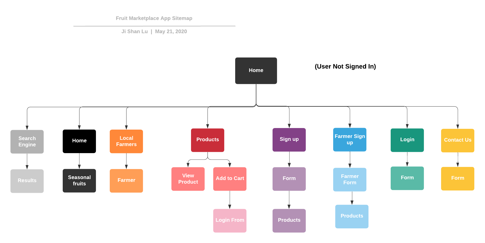
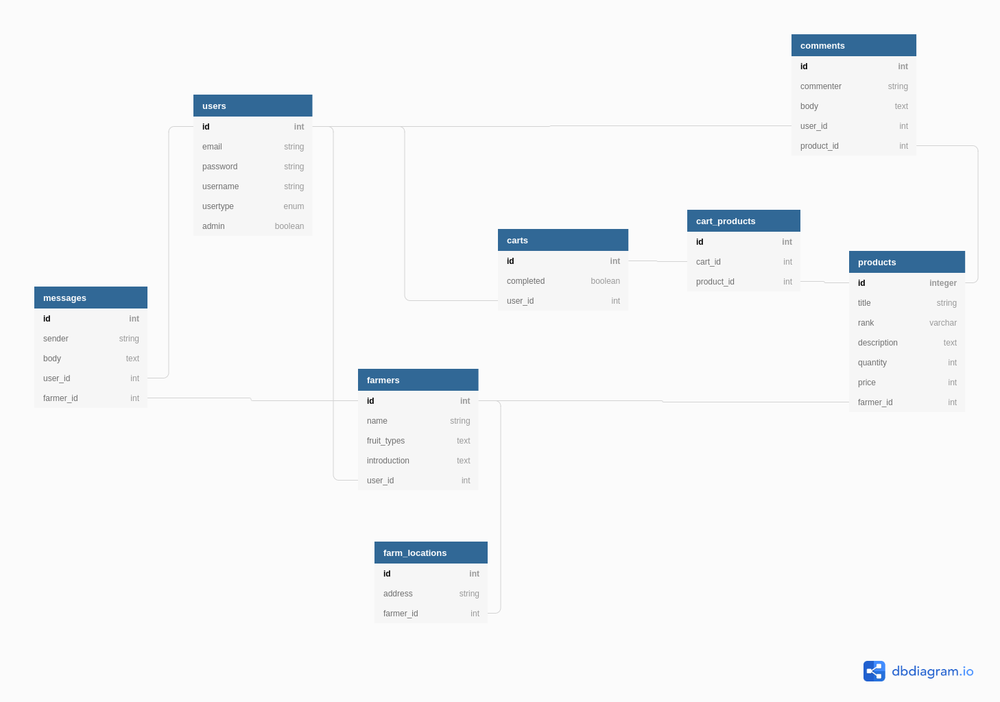
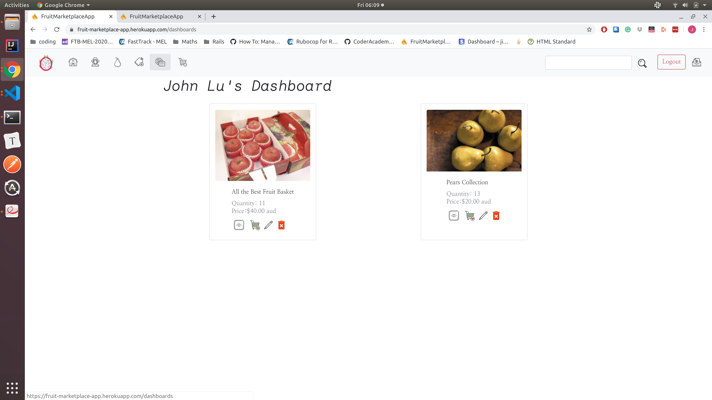

# README

# Two-Sided-Marketplace (fruit marketplace rails app)

### The link to my published App

https://fruit-marketplace-app.herokuapp.com/

### The link to the GitHub repository

https://github.com/jishan33/fruit_marketplace_app

## System Dependencies
 - rails 6.0.3
 - yarn insatll
 - bundle install
 

## Description 

### Purpose
Provide local fruit farmers a friendly online selling platform to assist farmers to increase their profit by saving the middle men handling costs, also to provide the freshest fruits deliver directly from the farms. Farmers having direct access to customers reduces the influence of large supermarket corporations and allows customers to know where products are produced. It also affords consumers more choice in which kind of products and farming techniques they want to support.

## User Stories

As a buyer, I want to sign up, login, and logout securely as well as make purchases via very secure websites so that I can transact securely. 

As a farmer, I want to sign up, login, and logout securely so that my business information stays safe.

As a farmer, I want to post my product with high visibility and add new products relatively easily to market directly to consumers. 

As a farmer, I would like to receive my payment easily and quickly to keep my business healthy and sustainable. 

As an admin, I want to have all the features that users and farmers have, except adding new products and receiving payments so that I can administer the site. 

As an admin, I want to easily manage users' products and users accounts so that I can correct mistakes or remove troublesome users.

### Farmers 
There is a form for farmers to sign up. Once they finised sign up, they can post their products to sell and also update and delete, they can easily manage their products on their dashboard. Also, the completed farmer sign up form will be posted on the local farmers page directly to increase their visibility. Farmer account can add products to their cart and purchase multiple products at once like normal buyers. 

### Users/Buyers
Users can select user sign up button to sign up. After signed up, users can view every page and add products to their carts and complete purchases via credit card and debit cards through stripe. The total amout of the payment will be dispalyed in a table in their cart page. Once the purchase is completed, the products quantity will be updated automatically. 

### Admin

Admin has the ability to manage all the posted products and it can manage farmers' intro posts. Moreover, admin can delete users' accounts. Nevertheless, admin can perform purchase functions too. 

## Functionality

### Search Engine
The search function is added to the top nav-bar. Eveyone can view the website and conduct searches. If they search price, all the products' prices less than the search price will be displayed and if they search words, any data matched to the word in products and farmers tables will be displayed, the partial matches are also included.

### Shopping Cart
User can add items to their cart and also delete items from their cart. User can buy the items from thier cart via stripe.

### Add Products to Sell
Farmers can add products to the products page and they can manage their own products from their dashboard page. 

### Contact Us

Contact us form is added on the bottom of the home page. People can send their inquiry or message via fromspree to our email acount. 

### Login 

Users can login and logout easily.


## Sitemap 
### User Not Sign In


### Admin 


### Target audience
Local fruit farmers and general people.

### Tech stack 
 - Ruby on Rails
 - sass
 - html
 - capybara
 - devise
 - CanCanCan
 - RSpec

## Explanation for three high-level components(abstractions)
### Active Record
Active record is an abstraction layer above SQL, it allows rails apps to declare models and relationships between models. Using this definition, it provides simple methods to create, read, delete, and update database records, representing these models. This allows the developer to write higher level code without worring the specifics of writing valid SQL statements or associated security issues, such as SQL injection.


### Active Storage
Active storage is an abstraction layer above online file storage solutions, such as Amazon S3. It allows rails developers to define attached images on their models. It then stores the metadata for these images in active storage tables and handles the uploading to s3. It also provides routes to fetch these images from s3 behind the scenes as well as helpers to allow app developers to link to these attachments in erb pages.


### Action View
Action view is a helper within rails which works with action controllers to make it easy to render the html views for your application. It relies on controllers to interact with the database and declare instance variables which can then be ready by embedded ruby code within an erb file. Action view also provides many helpers make the creation of html views easier such as form helpers which work with rails models to define forms for creating and updating and link helpers to make it easier to provide links to specific routes within the rails application. All of this helps the developer to write less repetitive and more meaningful code in their views which hopefully makes it easier to maintain.


## Entity Relationship Diagram



### Database Associations

##### Users
 - has one cart 
 - has one farmer

 The user table is meant to represent a user of the app. This could be either a customer who wants to buy fruit or a farmer who want to sell. The type of user is distinguished by the user_type enum column. A farmer user requires some additional informaton such as an image and address, so for a farmer user, there is also a has one relationship with a farmer entry which captures this information.

##### Farmers
 - belongs to user
 - has many products

 Farmers are the people who want to sell their products on the website. A user who is a farmer has an associated row here to capture some additional information only relevant to farmers. Also, as only farmers are able to list products on the website, a has many relationship is defined between farmers and products.

##### Products
 - belongs to farmer
 - has many carts

The products table captures basic information about the products on the website such as price, description and an image. Every product belongs to a farmer as farmers are the only people who may list products on the site. A product may also be placed into a users cart, therefore a has_many relationship exists between products and carts.

##### Carts
 - belongs to user
 - has many products

 The carts table provides the ability for users to create a collection of itemw which they wish to buy and have this persist if the user decides to come back later. As such, carts belong to users and have many products. Upon checkout, the cart for the specific user is emptied of products.


## Challenges

#### Database seeding issues

Seeding files id an essentially step for manipulating relational database, the seed file has to be setup properly and the furthur development can be continued.

This app has two types of users, farmer and normal. Farmers table belogs to users table, in other words, user model has an user-type attribute  using enum to disinguish farmer and normer. This relation setup is slightly more complicated while seeding users the user-type has to be specify and seeding farmers has to have a user-id that has a user-type called farmer. 


## Wireframes 


## Task tracking


## Third party services
 - Heroku
 - Amazon S3 bucket
 - Stripe
 - reCAPTCHA


## Credentials needed
Make sure your credentials.yml.enc looks like:

```
aws:
  access_key_id: <secret>
  secret_access_key: <secret>

stripe:
  secret_key: <secret>
  public_key: <secret>

recaptcha:
  site_key: <secret>
  secret_key: <secret>
```


## Screenshoots





